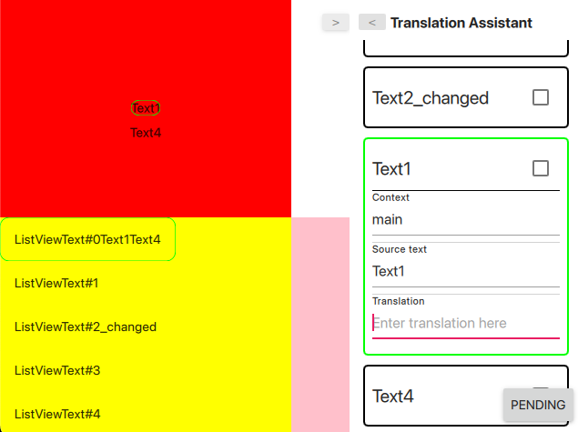

# Translation Assistant For Qt (work in progress)

This is(will be) a tool that makes it easier to translate a QML based application. 

The idea of this project is to allow you to edit translations live in your QML application, without having to use the typical flow with Qt Linguist.

In the above video you will see that the Translation Assistant adds a side menu that displays all the text that needs translations. 

If you click on one of the items in the list, the relevant translations from the app will become selected(with a light green border). You can also go the other way around and Control + Click an item from your application it will be selected automatically in the Translation Assistant view. 

If you enter a translation in the UI and press Enter, the UI will automatically updated with the new value. 

Note done yet: After you are done, you will be able to update the .ts file/s with the new translations.

# Notes

When it will work: When bindings for text properties are working. So text: x + qsTr("Text"), not text = x + qsTr("Text") (use Qt.binding instead). When you have up-to-date translation files

Can be extended with different strategies to customize for you specific use case:
    - text item extraction
    - translation identifiers
    - Could work for Qt C++ with appropriate retranslation handlings
    - etc

Minimum version: TBD(probably first version that supports QQmlEngine::retranslate, Qt 5.10)

# TODO
- Rename to TranslationAssistantForQml(maybe support C++ in the future)
- Can we use .qm files?
- Install directivess
- Save changes + test
- Find simpler ways to integrate in app
    - e.g. Another qml whose purpose is to only instantiate it. User will only instantiate a single QML type
    - Maybe something where no user interaction required
- Documentation + integration guide
- TODO comments from code
- Use onTextChanged to update the highlights(maybe using a QTimer so no spam, with max 1 update/s)
    - Note: ignore onTextChanged cause by temporary translator
- Suggested translations via DeepL or Google Translate